# 감탄 (GamTan)

> **감(感)지하다 + 탄(碳)소**: 탄소 감지 AI 에이전트

`제4회 iM:POSSIBLE Challenger (iM금융그룹 주최)` · **본선 진출** · 3인 팀 프로젝트
(원본 팀 저장소는 비공개이며, 이 저장소는 포트폴리오용 사본입니다. 저장소의 전표·고지서는 모두 합성 데이터입니다)

**내 역할 (김민지)** · 개발 2인 중 한 명으로 다음을 맡았습니다. 커밋 수 팀 1위, 팀원 PR 68건 리뷰·머지.
- 문서 추출·OCR 파이프라인 전담: PDF 텍스트 → PaddleOCR → 좌표 기반 표 매칭 → LLM 필드 라우팅의 4단계 폴백
- 사장님(owner) 앱 풀스택
- 초기 아키텍처와 개발 인프라 구성 (Docker Compose, Supabase)
- 팀 PR 리뷰·통합, Alembic 리비전 충돌 관리

세금계산서·전기/도시가스 고지서의 비정형 텍스트를 Paddle OCR 및 AI 에이전트가 읽어
기업의 탄소 배출량(Scope 1/2)을 자동 산정한다.

금융기관이 여신 포트폴리오 단위로 PCAF Business Loans 기준 금융배출량을 산정할 수 있게 하는 플랫폼이다.

**배포 사이트**: https://gam-tan.vercel.app/

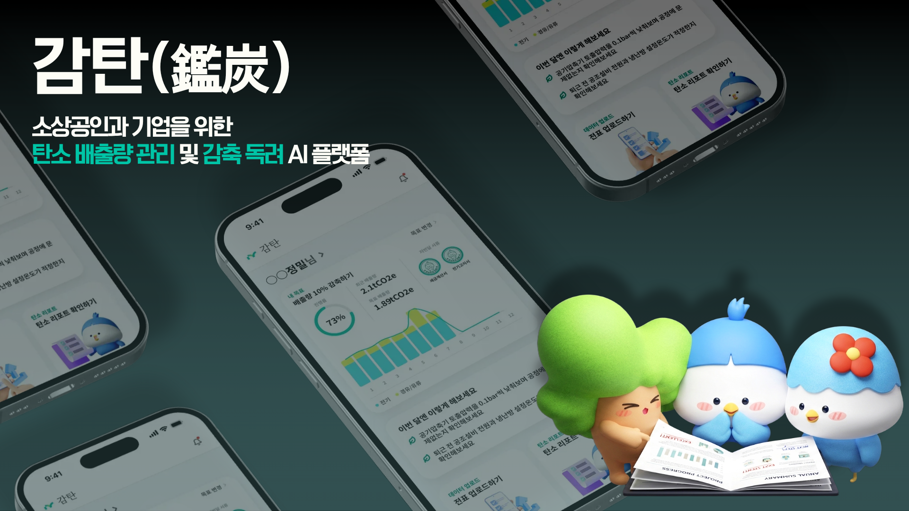

## Table of Contents

- [Why](#why)
- [How It Works](#how-it-works)
- [Admin Screens](#관리자은행-담당자-화면)
- [Design Principles](#design-principles)
- [Vision](#vision)
- [Stack](#stack)
- [Getting Started](#getting-started)
- [Project Structure](#project-structure)
- [License](#license)

## Why

대기업 실사, 공시 의무화, 790조 원 기후금융까지 탄소 데이터를 요구하는
제도는 이미 갖춰졌다.

그런데 정작 측정할 방법이 없는 중소기업·소상공인이
대부분이다. iM뱅크도 마찬가지다. 총여신의 63.2%가 기업대출인데(원화대출금
기준 37.8%), 상당수가 탄소 데이터 없이 통계 추정(PCAF 5등급)으로 채워져 있다.

감탄은 모든 기업이 보유한 세금계산서·전기 고지서 문서를 AI 에이전트가 대신 읽는다.
사장님은 마이데이터 연동 동의 1클릭 + 연료 유형 체크만 하면 된다.

- **기업**: 컨설팅 없이 무상·최소 입력으로 원청 제출용 탄소 데이터 확보
- **은행 담당자**: 통계 추정(PCAF 5등급) 포트폴리오를 전표 기반 실측(PCAF 2~3등급)으로 개선

## How It Works

전표 업로드 한 번이 리포트로 이어지는 과정이다.

### 1. 자료 업로드

마이데이터 연동 + 전표 업로드(사진/PDF/홈택스 엑셀). 로컬 OCR이 값을 읽는다.

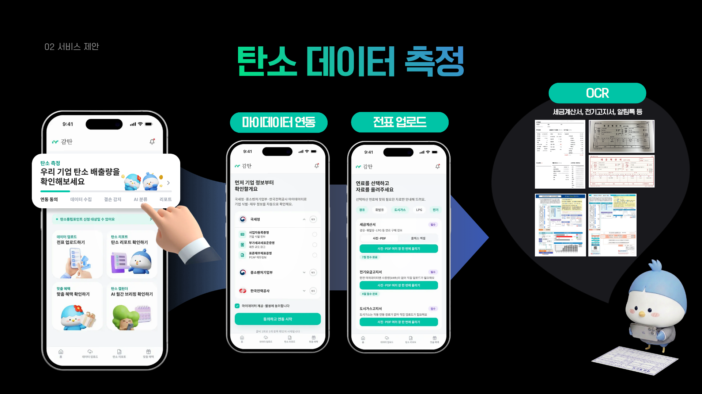

### 2. AI 에이전트 판단

결손 감지·이상치 자가검증·담당자 검토 이관까지, 판단 과정을 트레이스로 보여준다.

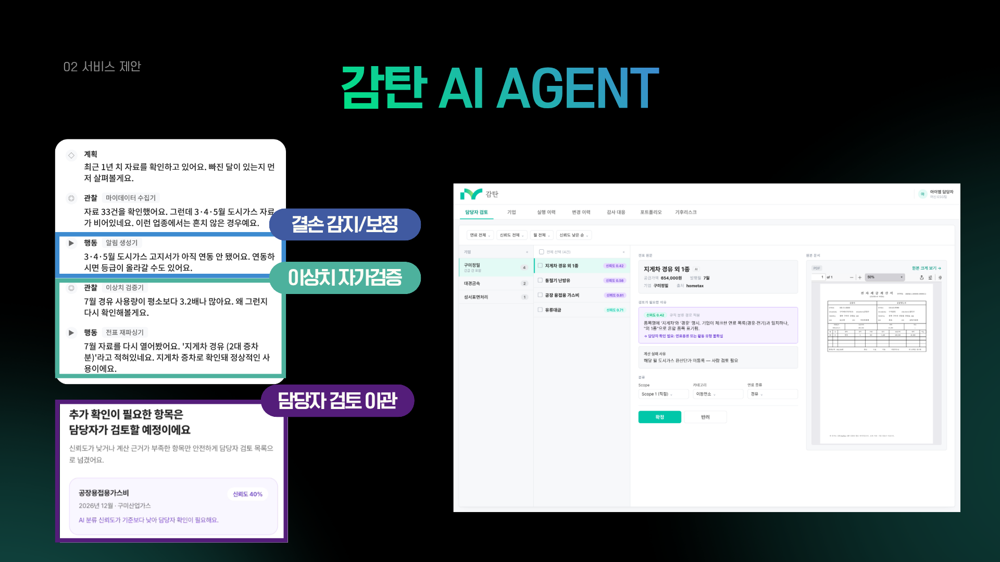

### 3. 탄소 리포트

Scope 1·2 배출량, PCAF 등급, 동종 업계 대비 위치, 이상 신호 알림을 한 화면에.

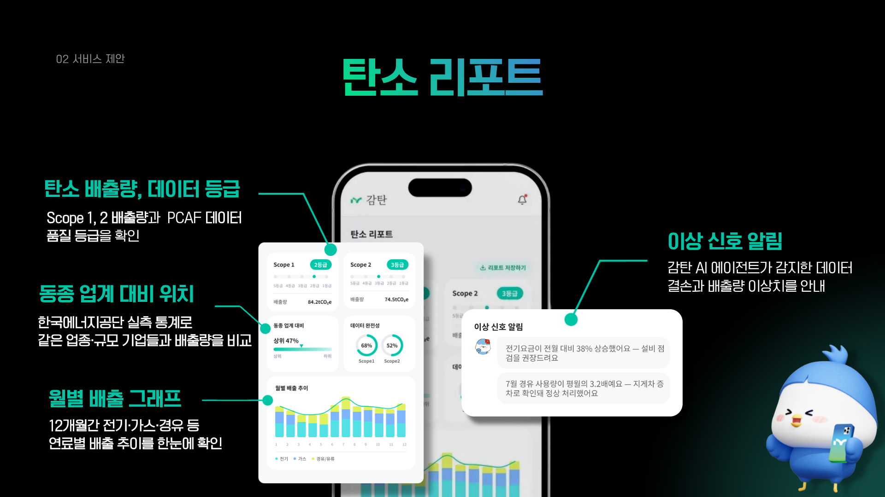

### 4. AI 브리핑 + 감축 독려

측정에서 끝나지 않고 꾸준히 감축하도록 동기를 붙인다. 마스코트가 매달
편지 형식으로 변화를 짚어주고, 배출량 감축·등급 상승 목표를 설정하면
업종·배출 이력에 맞춘 감축 미션을 제시한다.

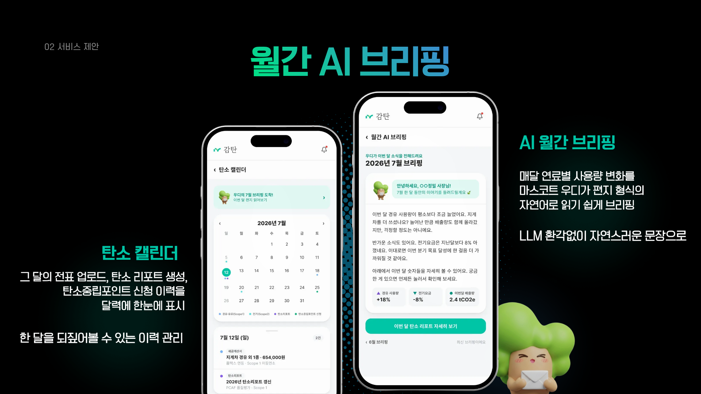
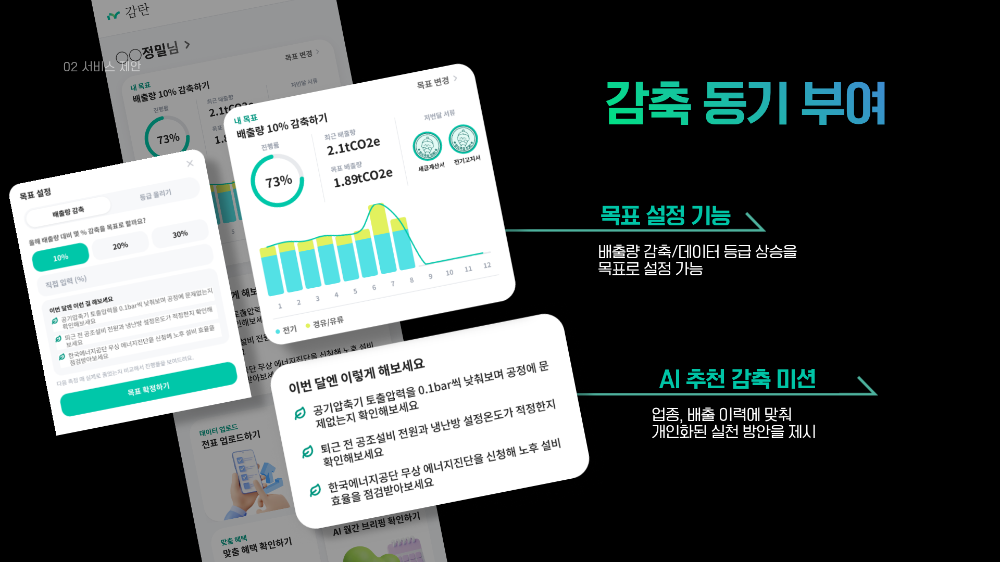

### 5. 맞춤 혜택 안내

ESG 우대금리·정부 지원사업 안내로 실질적 혜택까지 이어진다.

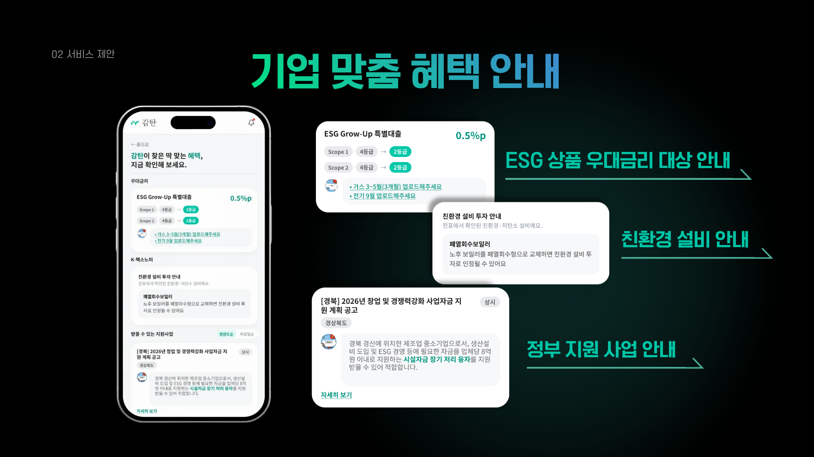

### 6. 소상공인 탄소중립포인트

감축 실적으로 받을 수 있는 인센티브를 안내하고 신청서 초안까지 만들어준다.

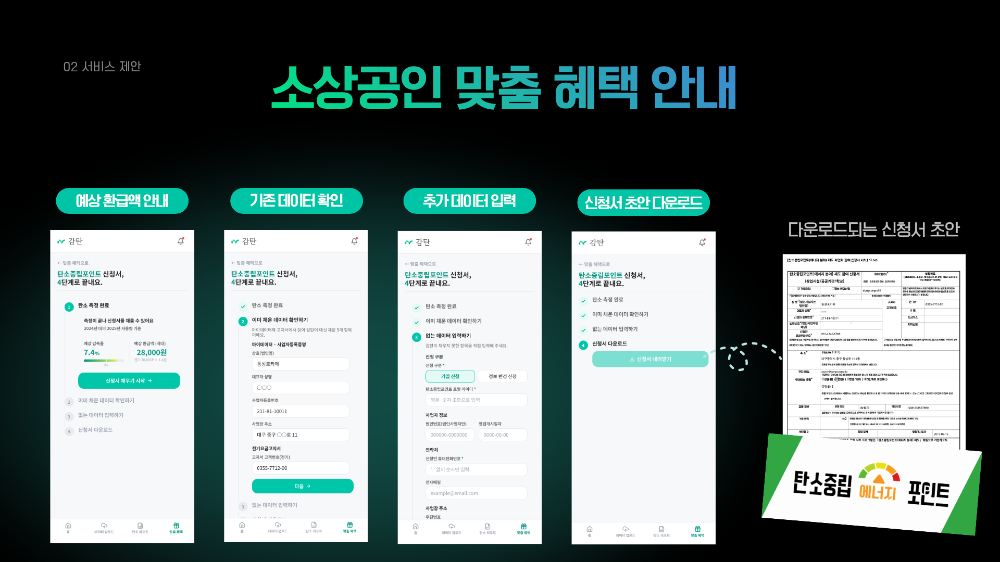

## 관리자(은행 담당자) 화면

사장님 쪽 시연 화면과 별도로, iM뱅크 담당자가 포트폴리오를 관리하는 화면이 있다.

### 담당자 검토(HITL) 큐

신뢰도 낮은 분류 건을 기업·연료·월별로 필터링해 확인하고 승인/반려한다.
전표 원문과 원본 문서를 나란히 보면서 판단한다.

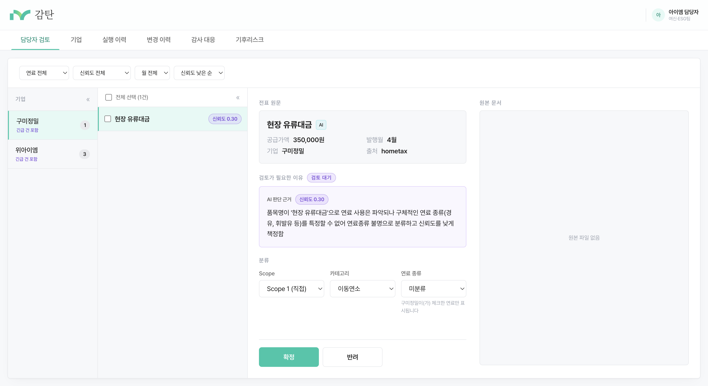

### 기업 탭

개별 기업의 PCAF 등급, Scope 1·2 배출량, 데이터 결손, 이상 신호 알림을
한 화면에서 확인한다.

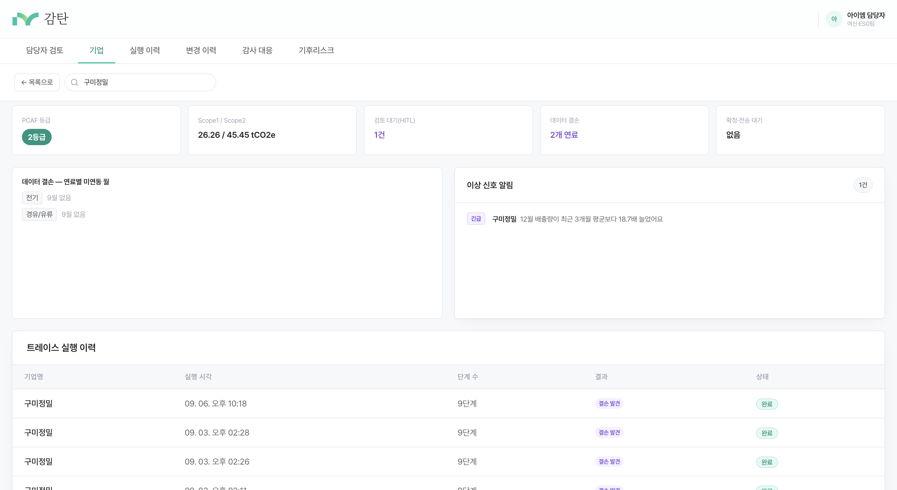

### 실행 이력

에이전트의 판단 과정을 [계획]/[관찰]/[행동] 단계별로, 원본 데이터(JSON)까지
그대로 조회할 수 있다.

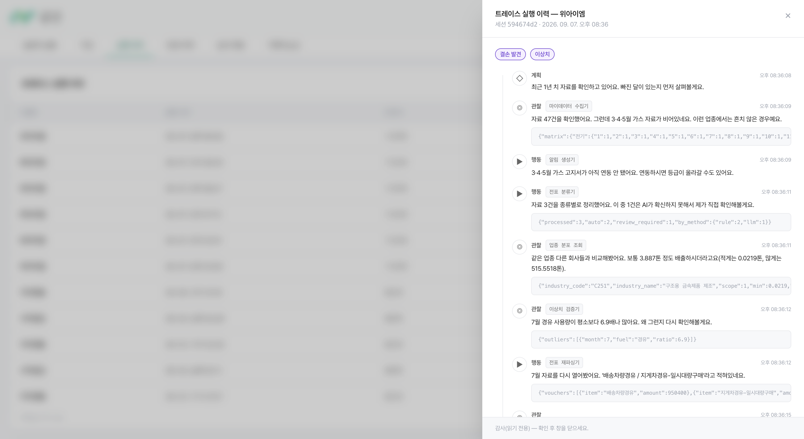

### 변경 이력 / 감사 대응

담당자의 승인·반려 이력과 원본문서 열람 로그를 별도로 기록한다.

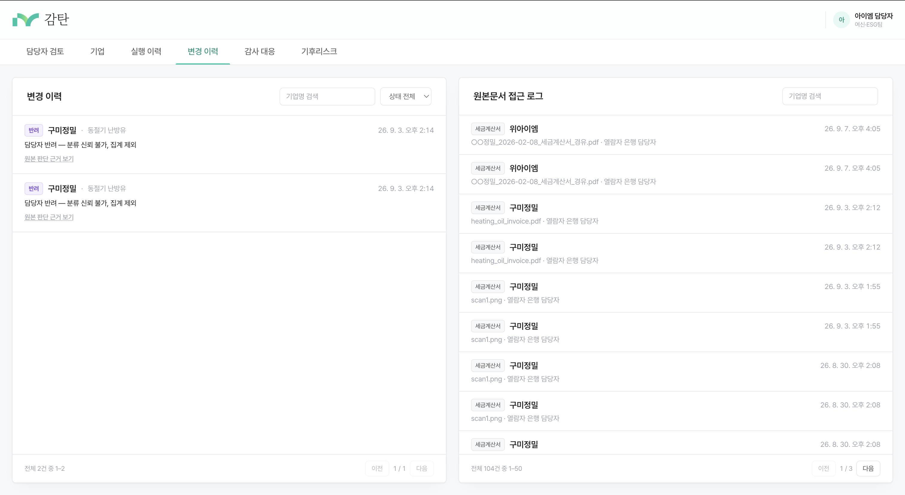

### 기후리스크

포트폴리오 단위 금융배출량, PCAF 등급 분포, 분류 정확도 등 검증 지표를
금감원 4단계 구조(거버넌스/전략/리스크평가/공시) 리포트로 확인한다.

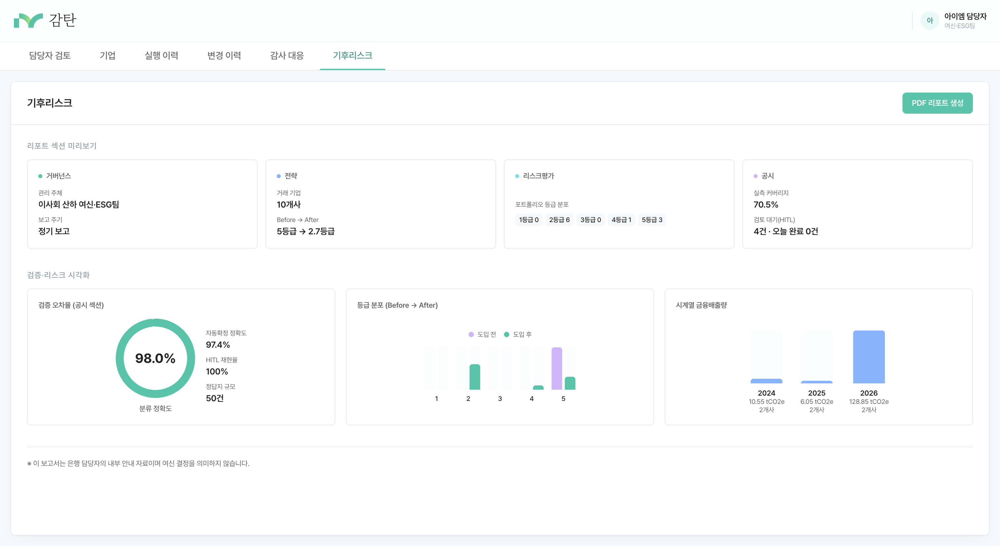

## Vision

제시한 확장 아이디어일 뿐, 이 저장소의 구현 범위는 아니다.
감탄이 산정한 감축 실적을 지역화폐 인센티브(전남·경남 선례)로 연결해,
소상공인 혜택 → 지역 소비 순환을 만드는 구상이다.

## Stack


| 레이어     | 구성                                                          |
| ---------- | ------------------------------------------------------------- |
| 백엔드     | FastAPI (Python), SQLAlchemy ORM, Alembic 마이그레이션        |
| 프론트엔드 | Next.js `/owner`(사장님 앱), `/admin`(관리자 웹)              |
| DB         | Supabase (PostgreSQL), 팀 공유 개발 DB                        |
| LLM        | Gemini API (google-genai) — 전표 분류·문서 라우팅·이상치 판단 |
| OCR        | PaddleOCR (한국어 모델, 로컬 구동)                            |
| 배포       | Docker Compose (로컬), Vercel (프론트), Render (백엔드 API)   |

## Getting Started

### 요구 사항

- Python 3.12
- Node.js 20+
- Docker / Docker Compose
- Supabase
- Gemini API

### 환경변수 설정

```bash
cp .env.example .env
# .env를 열어 DATABASE_URL, GEMINI_API_KEY 등을 채운다
```

각 항목의 용도는 [.env.example](./.env.example) 주석 참고.

### 로컬 실행 (Docker Compose)

```bash
docker compose up --build
```

- API: http://localhost:8010 (컨테이너 내부 8000)
- Web: http://localhost:3010 (컨테이너 내부 3000)

두 포트 모두 다른 프로젝트와 안 겹치게 호스트 쪽을 8010/3010으로 매핑했다.

### 테스트

```bash
pytest
```

## Project Structure

```
api/            FastAPI 라우터 (owner, admin, agent, classify, pcaf, mock 등)
db/             도메인 로직 — 모델, 문서 추출, PCAF 엔진, 리포트 생성
alembic/        DB 스키마 마이그레이션 (수동 ALTER 금지, 항상 새 revision)
web/app/        Next.js 라우트 (/owner, /admin)
data/           배출계수·환산단가 엑셀, 마이데이터·업로드 fixture
docs/           설계 문서 — DB 스키마, v1 진행 상황, 기능별 계획서
tests/          pytest — 소스 디렉토리 구조와 1:1 대응
```

## License

제4회 iM:POSSIBLE Challenger(iM금융그룹 주최 · 금융감독원 후원) 결선 출품작
